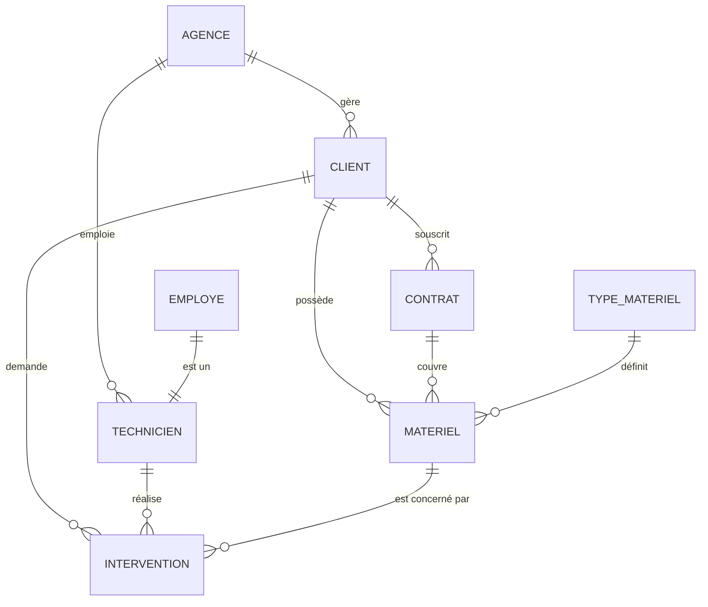
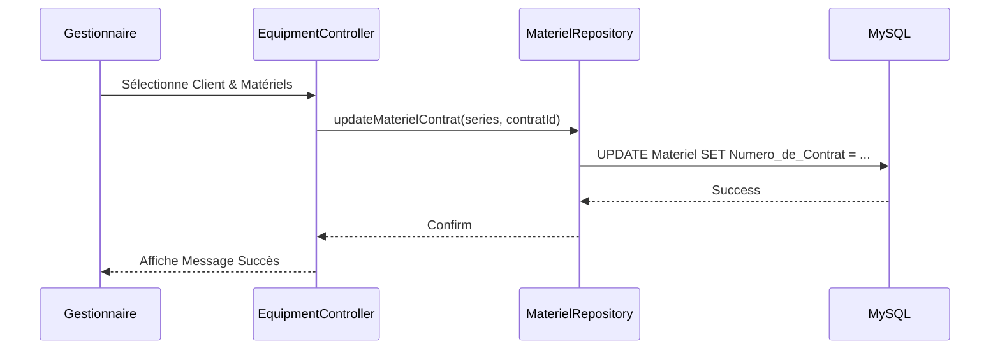

# 📄 Documentation Technique & Analyse Complète — CashCash

## 1. Introduction
**CashCash** est une application lourde (Desktop) développée avec **Electron** et **PHP**. Elle est conçue pour la gestion du parc matériel informatique et le suivi des interventions techniques pour les techniciens et les gestionnaires de l'entreprise.

L'innovation majeure de cette version est l'**embarquement d'un serveur PHP portable** directement dans l'exécutable, permettant à l'application de fonctionner sans installation préalable de serveur (WAMP/XAMPP) sur le poste client.

---

## 2. Architecture Logicielle

### 2.1 Pattern MVC (Modèle-Vue-Contrôleur)
L'application suit une architecture MVC stricte pour séparer les responsabilités :
- **Modèles (`src/Models`)** : Représentation des données (Utilisateur).
- **Repositories (`src/Repositories`)** : Couche d'accès aux données (DAL) utilisant PDO pour interagir avec la base de données.
- **Vues (`public/`, `src/Views`)** : Interface utilisateur (HTML/CSS) et fragments réutilisables.
- **Contrôleurs (`src/Controllers`)** : Logique de traitement des requêtes et pilotage des modèles/vues.

### 2.2 Stack Technique
- **Frontend** : HTML5, CSS3 (Vanilla), JavaScript.
- **Backend** : PHP 8.2+ (MVC).
- **Runtime** : Electron (Framework pour applications desktop).
- **Serveur** : Serveur PHP built-in piloté par Node.js.
- **Base de données** : MySQL / MariaDB.

---

## 3. Analyse de Données

### 3.1 MCD (Modèle Conceptuel de Données)


### 3.2 MLD (Modèle Logique de Données)
- **Type_Materiel** (<u>Reference_Interne</u>, Libelle_Type_materiel)
- **Materiel** (<u>Numero_de_Serie</u>, Date_de_vente, Date_d_installation, Prix_de_Vente, Emplacement, #Reference_Interne, #Numero_Client, #Numero_de_Contrat)
- **Client** (<u>Numero_Client</u>, Raison_Sociale, Siren, Code_Ape, Adresse, Telephone_Client, Email, Duree_Deplacement, Distance_KM, #Numero_Agence)
- **Contrat_de_maintenance** (<u>Numero_de_Contrat</u>, Date_signature, Date_echeance, #Numero_Client, #RefTypeContrat)
- **Intervention** (<u>Numero_Intervent</u>, Date_Visite, Heure_Visite, #Matricule_Technicien, #Numero_Client, #Numero_de_Serie, Temps_Passe, Commentaire)
- **Utilisateur** (<u>id</u>, username, password_hash, role, nom, prenom, email)

---

## 4. Analyse Fonctionnelle (UML)

### 4.1 Diagramme de Cas d'Utilisation
```mermaid
useCaseDiagram
    actor "Technicien" as T
    actor "Gestionnaire" as G

    G -- (Gérer les interventions)
    G -- (Associer matériel au contrat)
    G -- (Générer XML Client)
    G -- (Générer PDF Relance)
    
    T -- (Consulter ses interventions)
    T -- (Saisir un rapport d'intervention)
    T -- (Générer PDF Intervention)

    (Authentification) <.. (Gérer les interventions) : include
```

### 4.2 Diagramme de Séquence (Association Matériel)


---

## 5. Fonctionnalités Détaillées

### 5.1 Gestion des Interventions
- **Planification** : Création d'interventions avec assignation à un technicien spécifique.
- **Suivi** : Statuts évolutifs (En attente, En cours, Terminée).
- **Rapports** : Saisie de commentaires techniques et temps passé par le technicien.

### 5.2 Module Client & Matériel
- **Association Intelligente** : Interface optimisée pour lier des équipements vendus à des contrats de maintenance actifs.
- **Inventaire** : Vue détaillée du parc matériel par client.

### 5.3 Exports & Rapports
- **XML** : Génération de fichiers structurés pour l'échange de données.
- **PDF** : 
    - Fiches d'intervention pour signature.
    - Lettres de relance pour les contrats arrivant à échéance.

---

## 6. Tests et Validation

### 6.1 Tests Unitaires
L'application utilise une structure permettant de tester les **Repositories** et les **Controllers** :
- **Validation des données** : Vérification que les ID clients et numéros de série existent avant insertion.
- **Intégrité Référentielle** : Test des contraintes de clés étrangères lors des suppressions.
- **Logique d'Authentification** : Tests sur le hachage des mots de passe et la vérification des rôles.

### 6.2 Tests d'Intégration (Electron)
- Vérification du démarrage du serveur PHP sur un port aléatoire.
- Test de la communication entre le processus Main (Node.js) et le processus Renderer (Chrome).

---

## 7. Guide de Build (Sans Serveur)

### 7.1 Pourquoi "Sans Serveur" ?
Grâce au dossier `php-portable`, l'application contient son propre interpréteur PHP. Lors du build avec `electron-builder`, ce dossier est extrait dans les ressources de l'application.

### 7.2 Procédure de Build
1. **Préparation** : S'assurer que le dossier `php-portable` contient `php.exe` et ses DLL.
2. **Installation** : `npm install`
3. **Compilation** : `npm run build:win`
4. **Sortie** : Le fichier `.exe` dans le dossier `dist/` est prêt à être installé sur n'importe quel PC Windows.

---

## 8. Maintenance et Évolutivité
- **Logs** : Les erreurs PHP sont journalisées dans le dossier temporaire du système ou dans un fichier de log dédié.
- **Sécurité** : 
    - Isolation du code source (`src/`) hors du Document Root.
    - Utilisation de requêtes préparées PDO contre les injections SQL.
    - Hachage `PASSWORD_BCRYPT` pour les mots de passe.
